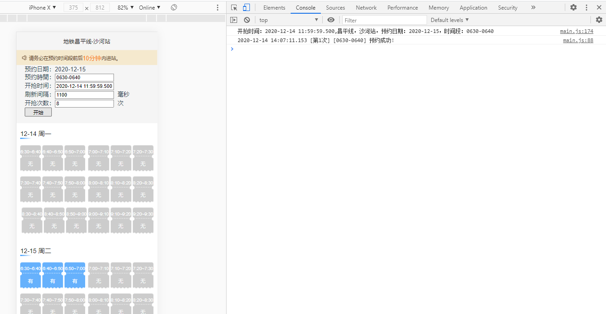

# 北京地铁预约出行（天通苑站，沙河站，草房站）

### 1、安装[谷歌浏览器插件](https://jingyan.baidu.com/article/f3ad7d0f58d6b609c3345b80.html) 
### 2、https://webui.mybti.cn/ 登录
### 3、在预约页面按F5刷新，如下图，
- 设置 预约时间，例如：6:30~6:40 需要写成 0630-0640。
- 刷新间隔不易太快，太快容易报错

